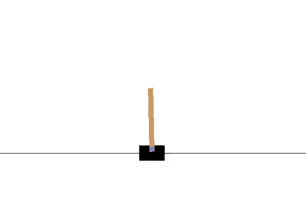
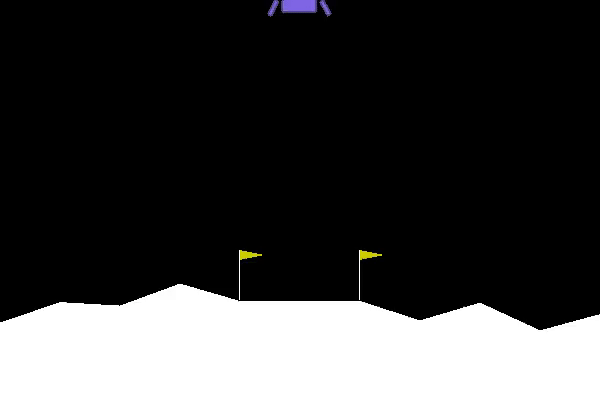
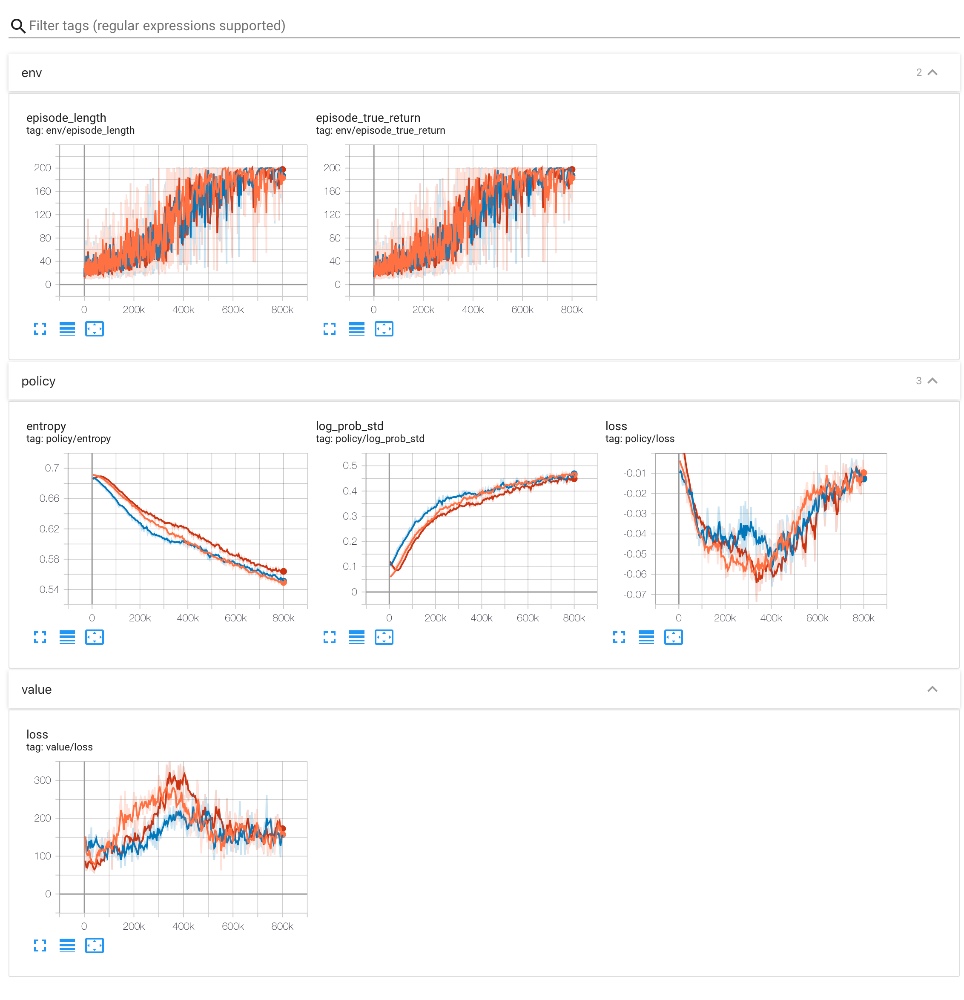
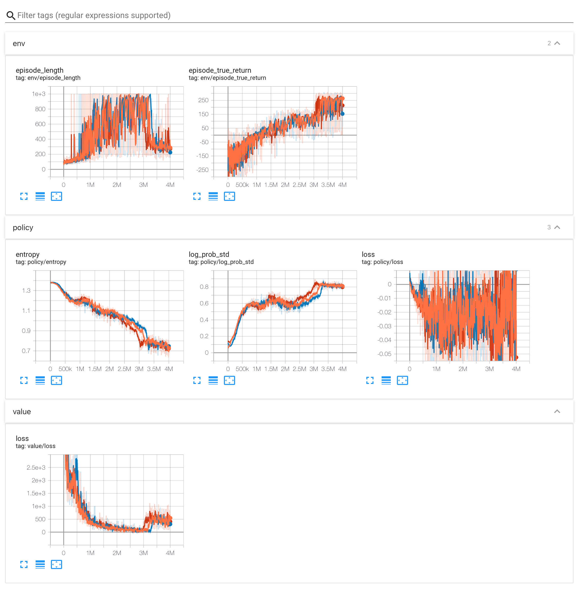

# Reinforcement Learning Replications
Reinforcement Learning Replications is a set of Pytorch implementations of reinforcement learning algorithms.

## Benchmarks

The Reinforcement Learning Replications is benchmarked in two environments from the OpenAI Gym: CartPole-v0 and LunarLander-v2.

All experiments were run for 3 random seeds each. Graphs show the each experiment (solid line) on TensorBoard.

|               CartPole-v0              |                LunarLander-v2                |
|:--------------------------------------:|:--------------------------------------------:|
|  |  |

### Vanilla Policy Gradient (REINFORCE)

##### example code

You can run each benchmark experiment changing `seed` and `env_name` to reproduce the results.

```python
import datetime

import gym
import torch

from rl_replicas.algorithms import VPG
from rl_replicas.common.policy import Policy
from rl_replicas.common.value_function import ValueFunction
from rl_replicas.common.torch_net import mlp

env_name = 'CartPole-v0' # CartPole-v0 or LunarLander-v2
output_dir = './runs/vpg/' + datetime.datetime.now().strftime("%Y%m%d-%H%M%S")
epochs = 200
seed = 0 # from 0 to 2

policy_network_architecture = [64, 64]
value_function_network_architecture = [64, 64]
policy_learning_rate = 3e-4
value_function_learning_rate = 1e-3

env = gym.make(env_name)

policy_network = mlp(
  sizes = [env.observation_space.shape[0]]+policy_network_architecture+[env.action_space.n]
)

policy: Policy = Policy(
  network = policy_network,
  optimizer = torch.optim.Adam(policy_network.parameters(), lr=policy_learning_rate)
)

value_function_network = mlp(
  sizes = [env.observation_space.shape[0]]+value_function_network_architecture+[1]
)
value_function: ValueFunction = ValueFunction(
  network = value_function_network,
  optimizer = torch.optim.Adam(value_function_network.parameters(), lr=value_function_learning_rate)
)

model: VPG = VPG(policy, value_function, env, seed=seed)

model.learn(
  epochs=epochs,
  output_dir=output_dir,
  tensorboard=True,
  model_saving=True
)
```


#### CartPole-v0

Sample result and trained model stored at `./runs/vpg/CartPole-v0`.



#### LunarLander-v2

Sample result and trained model stored at `./runs/vpg/LunarLander-v2`.


